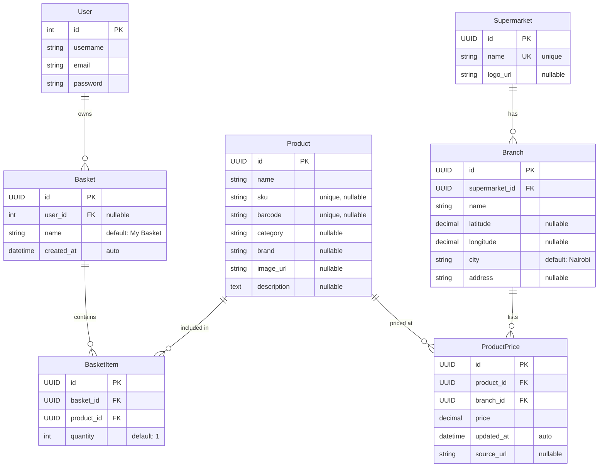

# SaveBasket — Entity-Relationship Diagram

## Overview

SaveBasket is a grocery price-comparison platform. Users build shopping baskets of products and compare total costs across supermarket branches. The data model captures **supermarkets and their branches**, a **product catalogue with per-branch pricing**, and **user baskets** containing basket items.

---

## ER Diagram

---

## Relationship Summary

| Relationship | Type | Description |
|---|---|---|
| **User → Basket** | One-to-Many | A user can own many baskets; a basket optionally belongs to one user |
| **Supermarket → Branch** | One-to-Many | A supermarket chain has many physical branch locations |
| **Branch → ProductPrice** | One-to-Many | Each branch lists prices for many products |
| **Product → ProductPrice** | One-to-Many | A product can be priced at many different branches |
| **Basket → BasketItem** | One-to-Many | A basket contains many line items |
| **Product → BasketItem** | One-to-Many | A product can appear in many baskets |

> **ProductPrice** acts as an associative (junction) entity between **Product** and **Branch**, carrying the `price` attribute and enforcing a unique constraint on `(product, branch)`.

> **BasketItem** acts as an associative entity between **Basket** and **Product**, carrying the `quantity` attribute and enforcing a unique constraint on `(basket, product)`.

---

## Constraints & Notes

- All custom models use **UUID** primary keys (auto-generated via `uuid4`).
- **User** is Django's built-in `auth.User` model (integer PK).
- `Basket.user` is **nullable** — anonymous/guest baskets are supported.
- `ProductPrice` has a composite unique constraint on `(product, branch)` — one price per product per branch.
- `BasketItem` has a composite unique constraint on `(basket, product)` — no duplicate products in a basket.
- `Branch` has a composite unique constraint on `(supermarket, name)`.
